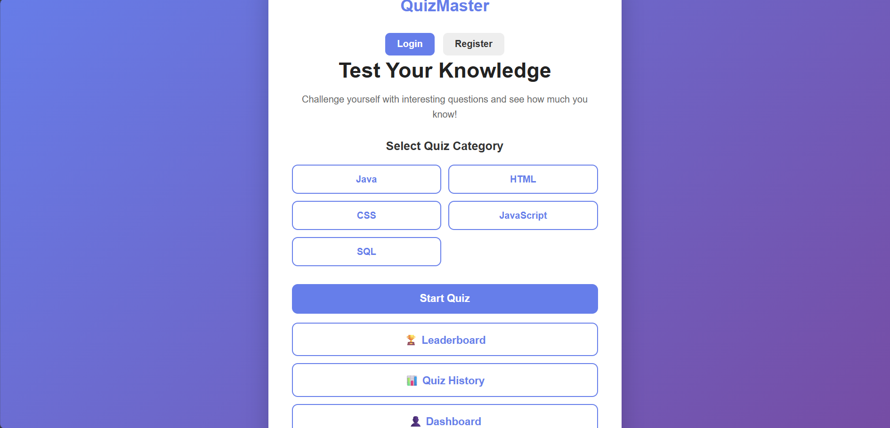
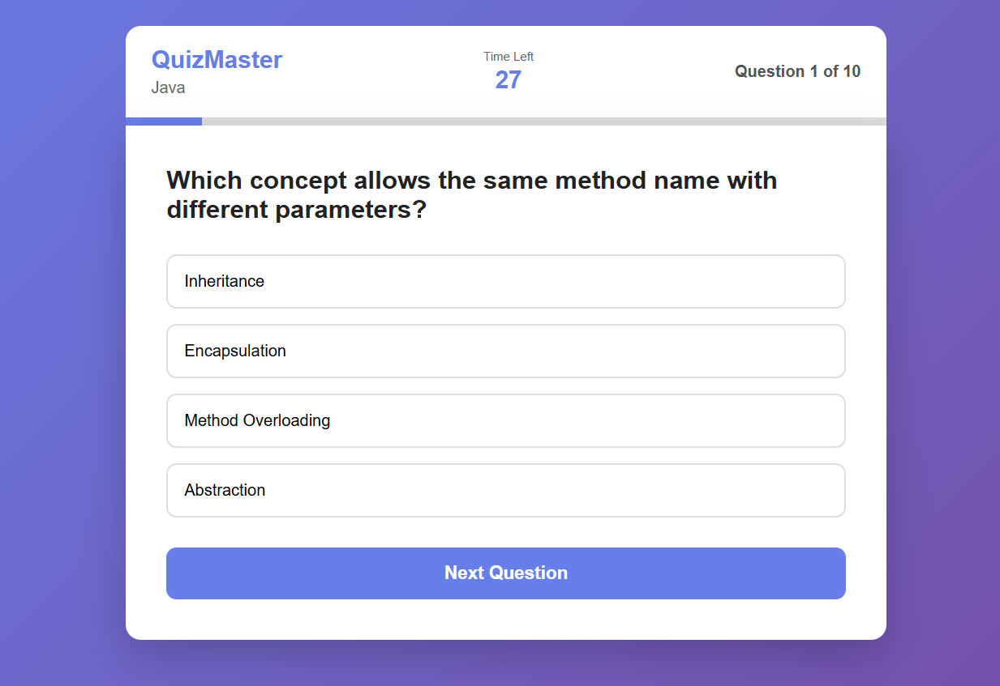
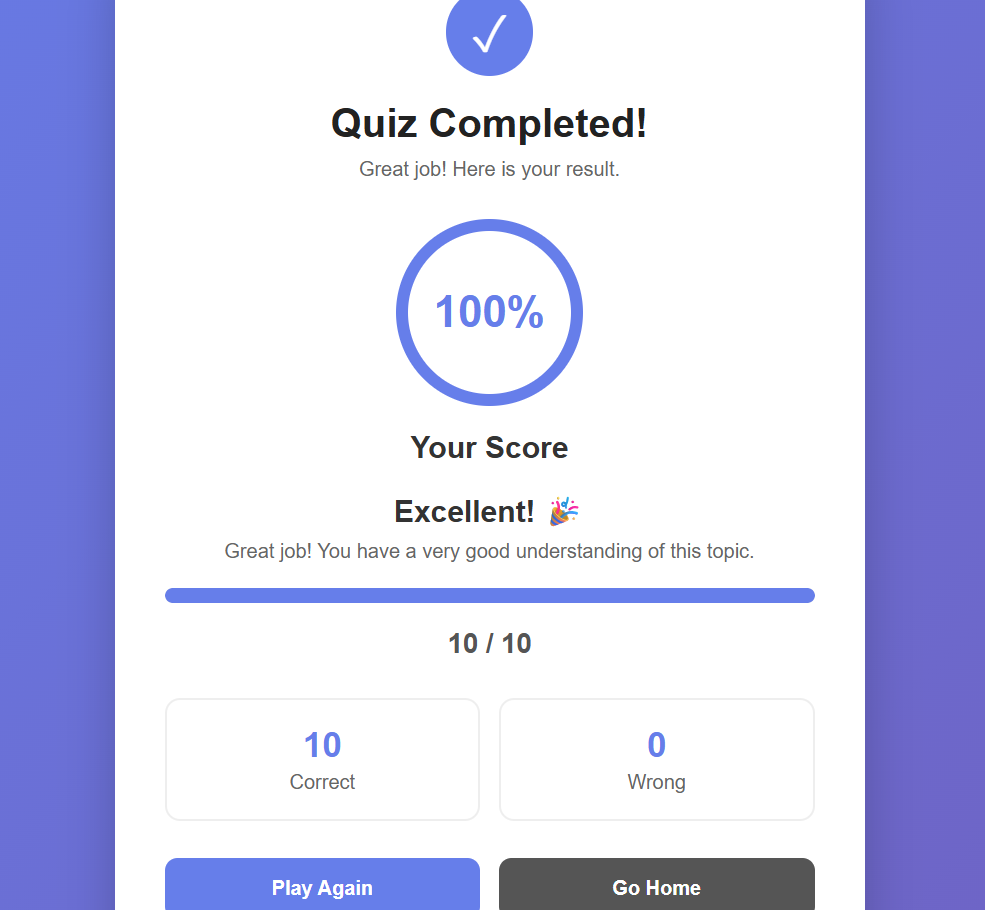
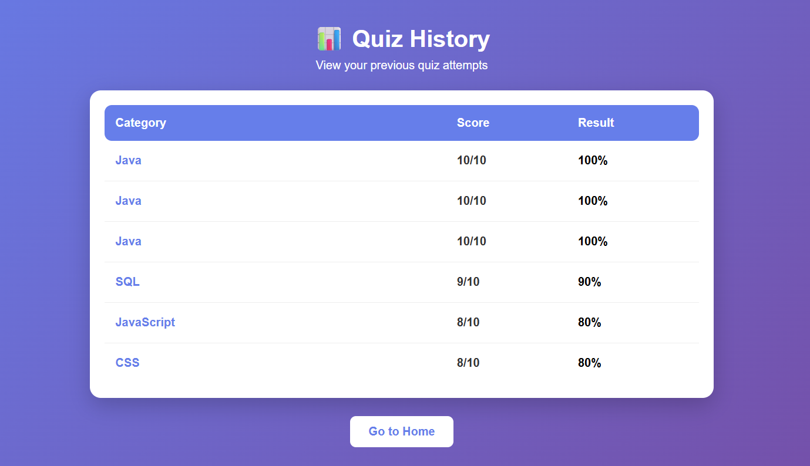
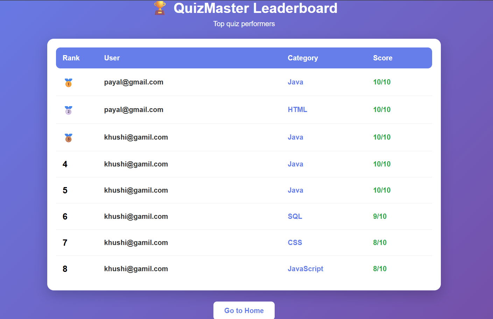
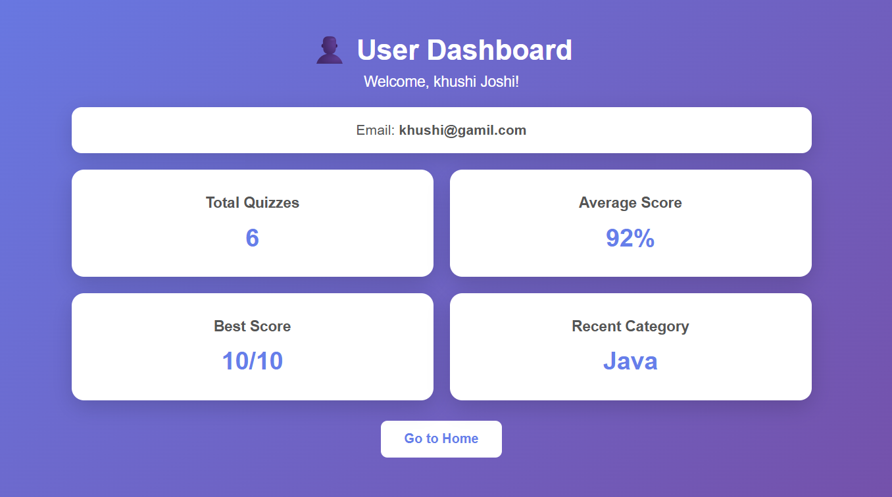
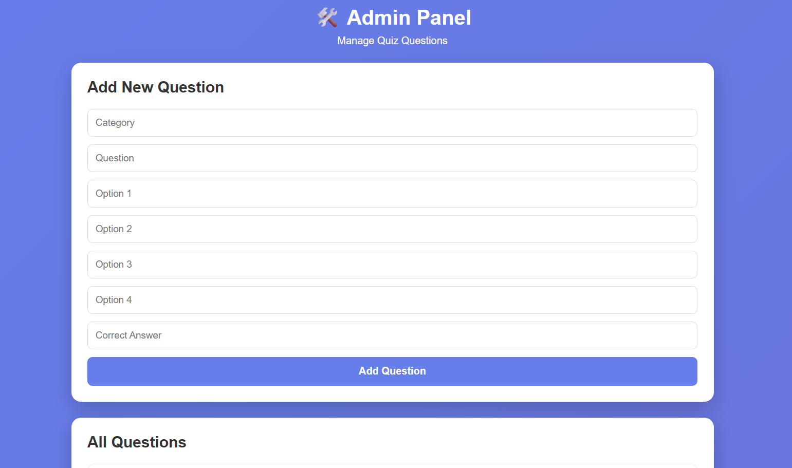
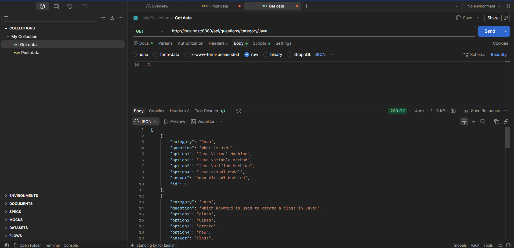
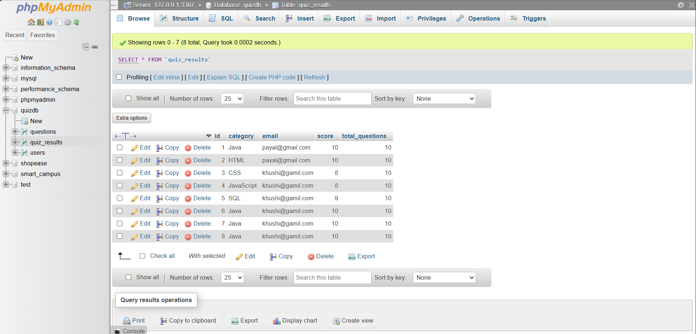

# QuizMaster -- Full-Stack Quiz Application

QuizMaster is a full-stack quiz application built using **Java, Spring
Boot, MySQL, HTML, CSS, and JavaScript**.

It allows users to register and log in, select quiz categories, take
timed quizzes, view results, review answers, check quiz history, view a
leaderboard and dashboard, while an Admin Panel provides question
management.

## 🚀 Features

### User Features

-   User registration and login
-   BCrypt password hashing
-   Category-based quizzes
-   Java, HTML, CSS, JavaScript and SQL categories
-   30-second timer for each question
-   Randomized question order
-   Automatic score calculation
-   Result percentage, correct and wrong answers
-   Answer review
-   Quiz history
-   User dashboard
-   Leaderboard

### Admin Features

-   View all quiz questions
-   Add new questions
-   Delete questions
-   Question management through REST APIs

### Security

-   BCrypt password hashing
-   Password excluded from JSON API responses
-   BCrypt password verification during login

## 💻 Tech Stack

**Frontend:** HTML5, CSS3, JavaScript, Fetch API, LocalStorage

**Backend:** Java, Spring Boot, Spring Web, Spring Data JPA, REST APIs,
BCrypt

**Database:** MySQL, Hibernate/JPA

**Tools:** VS Code, Maven, Postman, XAMPP/MySQL, Git and GitHub

## 📁 Project Structure

``` text
QuizMaster
├── QuizProject
│   ├── index.html
│   ├── login.html
│   ├── register.html
│   ├── quiz.html
│   ├── result.html
│   ├── quizhistory.html
│   ├── leaderboard.html
│   ├── dashboard.html
│   ├── admin.html
│   ├── css/
│   └── js/
│
└── quizbackend
    ├── pom.xml
    └── src/main/java/com/payal/quizbackend/
        ├── entity/
        ├── repository/
        ├── service/
        └── controller/
```

## ⚙️ Setup Instructions

### 1. Clone the repository

``` bash
git clone https://github.com/PayalSharma15/QuizMaster.git
cd QuizMaster
```

### 2. Create the MySQL database

Start MySQL using XAMPP or your MySQL installation and create:

``` sql
CREATE DATABASE quizdb;
```

The current project uses MySQL port `3307`.

In `application.properties`:

``` properties
server.port=8080
spring.datasource.url=jdbc:mysql://localhost:3307/quizdb
spring.datasource.username=root
spring.datasource.password=
spring.jpa.hibernate.ddl-auto=update
spring.jpa.show-sql=true
```

Do not commit real database passwords or other secrets to GitHub.

### 3. Start the backend

Open a terminal in the Spring Boot project directory and run:

``` bash
mvn spring-boot:run
```

Backend:

``` text
http://localhost:8080
```

### 4. Run the frontend

Open `QuizProject` in VS Code and run `index.html` using Live Server.

## 🔗 REST APIs

### User

``` text
POST /api/users/register
POST /api/users/login
```

### Questions

``` text
GET    /api/questions
GET    /api/questions/category/{category}
POST   /api/questions
DELETE /api/questions/{id}
```

### Results

``` text
POST /api/results
GET  /api/results/leaderboard
GET  /api/results/history/{email}
GET  /api/results/dashboard/{email}
```

## 📸 Screenshots

Create a `screenshots` folder in the project root and add the following
images:

### Home Page



### Login / Registration


### Quiz Page



### Result Page



### Quiz History



### Leaderboard



### User Dashboard



### Admin Panel



### Postman API



### MySQL Database



GitHub will display these images automatically when the files are placed
at the paths above.

## 🔄 Application Flow

``` text
User
 ↓
Register / Login
 ↓
Select Quiz Category
 ↓
Spring Boot REST API
 ↓
MySQL Questions
 ↓
Timed Quiz
 ↓
Score & Answer Review
 ↓
Save Result in MySQL
 ↓
History / Dashboard / Leaderboard
```

## 🔐 Password Security

Passwords are hashed using BCrypt before being stored in MySQL.

``` text
User Password
      ↓
BCrypt Hashing
      ↓
Hashed Password
      ↓
MySQL
```

During login, BCrypt verifies the entered password against the stored
hash. The password is also excluded from JSON responses.

## 📚 What I Learned

-   Java and Spring Boot
-   REST API development
-   Spring Data JPA
-   MySQL integration
-   Entity, Repository, Service and Controller architecture
-   CRUD operations
-   Authentication
-   BCrypt password security
-   Postman API testing
-   JavaScript Fetch API
-   LocalStorage
-   Git and GitHub
-   Frontend-backend integration
-   Full-stack application development

## 🔮 Future Improvements

-   JWT-based authentication
-   Role-based admin authentication
-   Difficulty levels
-   Pagination
-   Improved mobile UI
-   Cloud deployment
-   Multiplayer quiz mode

## 👩‍💻 Author

**Payal Sharma**

MCA Student \| Java \| Spring Boot \| Web Development \| Data Structures
& Algorithms

**GitHub:** https://github.com/PayalSharma15/QuizMaster

## ⭐ Project Status

**Core full-stack QuizMaster application completed.**

The project includes frontend, Spring Boot backend, MySQL integration,
authentication, timed quizzes, results, answer review, quiz history,
dashboard, leaderboard, admin question management and BCrypt password
security.
